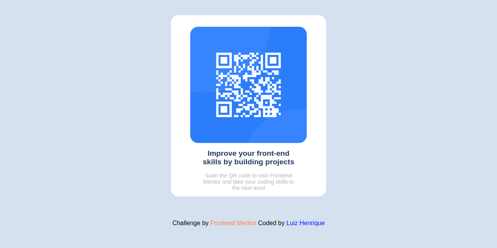
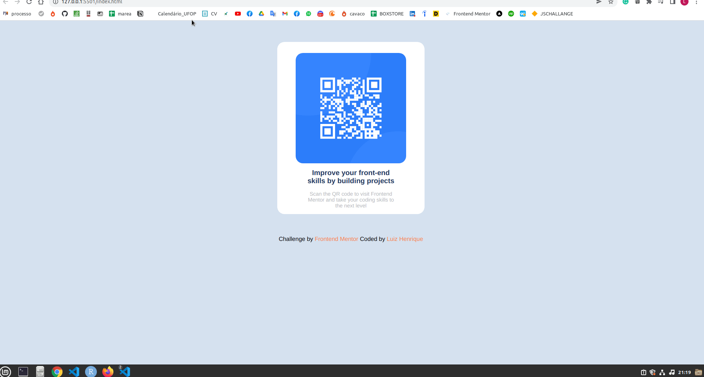

<h1 align="center"># Frontend Mentor - QR code component challange!</h1>

    

   

Este projeto serviu para que eu pudesse inciar o contato com o HTML e o CSS, e por em prática o conteúdo estudado. Se trata apenas de uma página estática com textos e 
    uma imagem contendo um QR code. Vale ressaltar que o QR code fa imagem é totalmente funcional e basta apontar um leitor de para o código e ele gerará um link! 

   

<h2>Responsividade do projeto</h2>

<h1 align="center">
    
</h1>